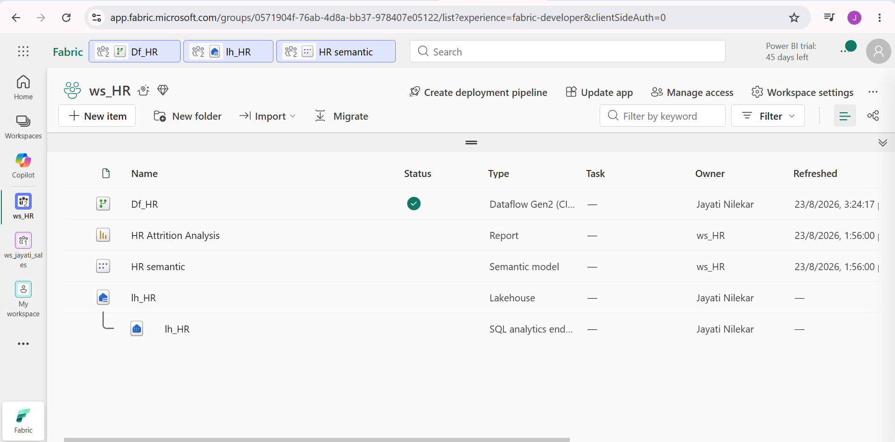
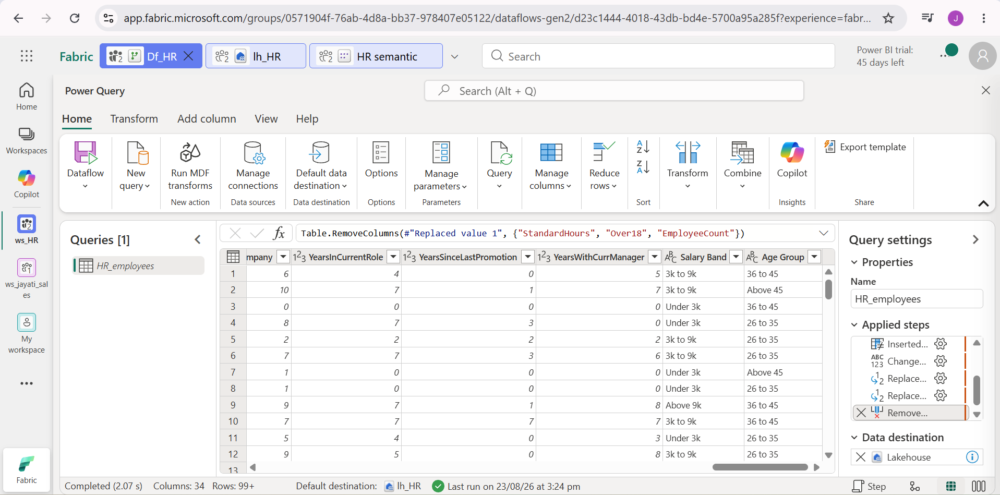
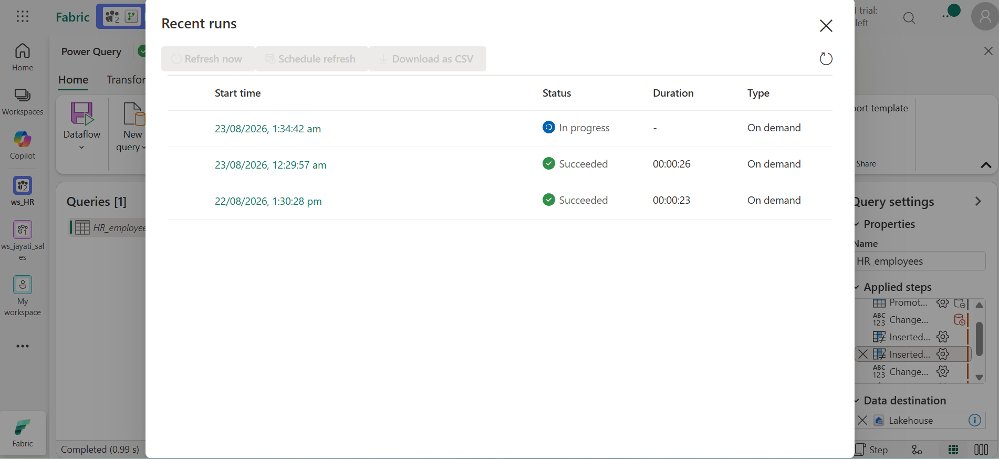
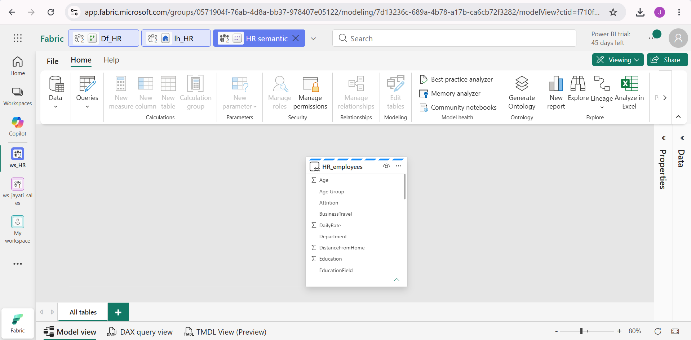
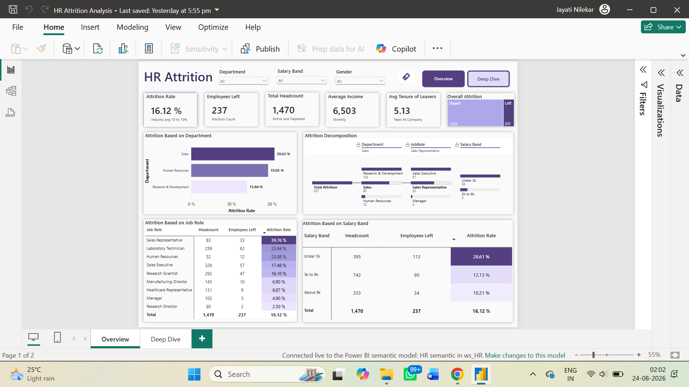
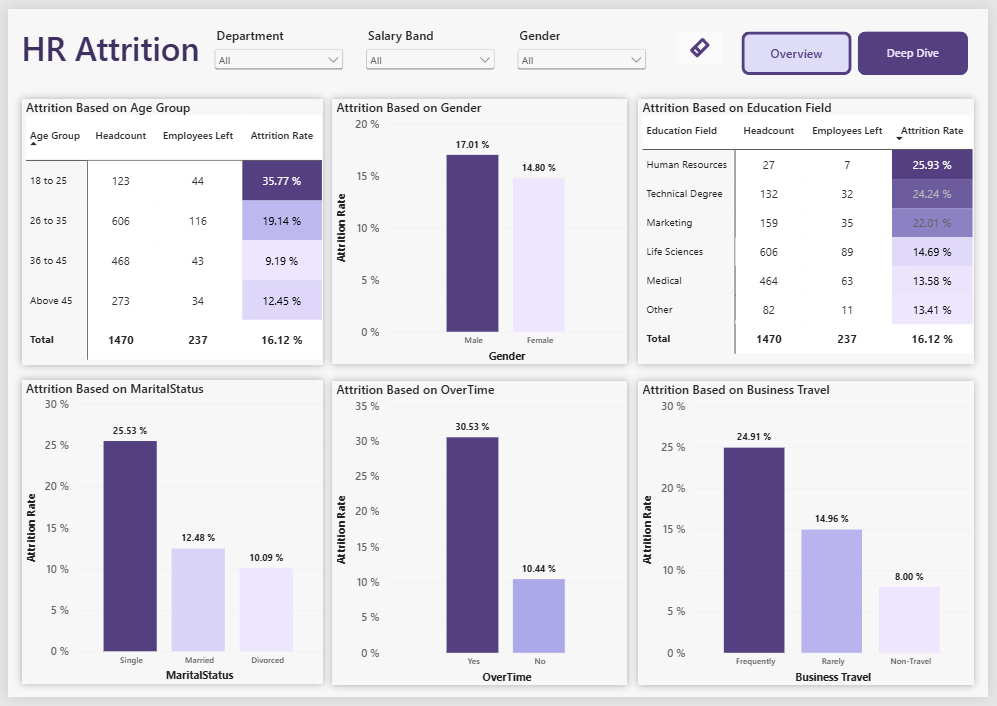
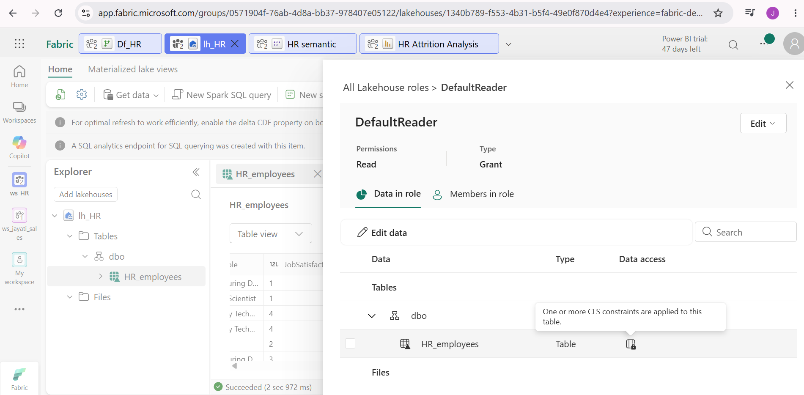
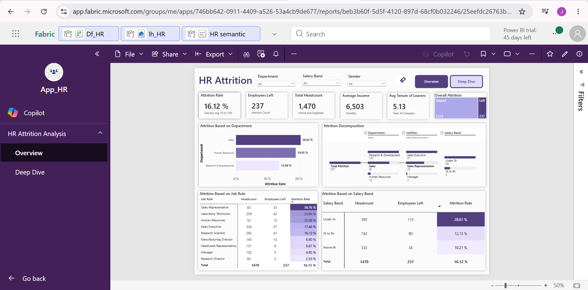
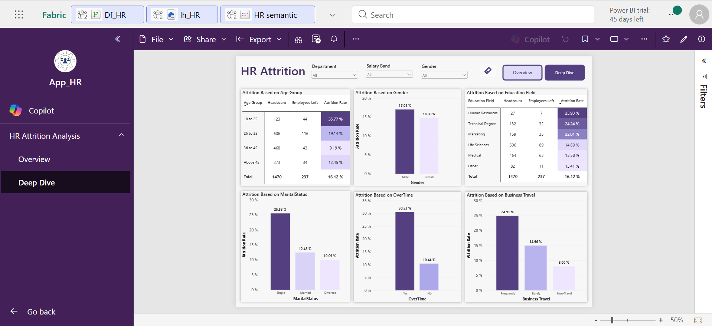

# HR Attrition Analysis
 
## 1. Project Title
**HR Attrition Analysis**
 
Built an end-to-end HR Attrition Analysis solution in Microsoft Fabric, ingesting 1,470 employee records through Dataflow Gen2 and surfacing attrition drivers across department, salary band, and age.
 
## 2. Short Description
The HR Attrition Analysis is an analytical report designed to help HR understand why the attrition rate has crept up to ~16% annually over the last two years. This dashboard focuses on surfacing attrition drivers across department, salary band, age, business travel, education field, and job role. This tool is intended for use by data analysts, the HR department, management, and data-driven strategists who want to understand attrition trends.
 
## 3. Tech Stack
The dashboard was built using the following tools and technologies:

Ingested 1,470 employee records through an online dataset.
- **Microsoft Dataflow Gen2** – Ingested 1,470 employee records through an online dataset and applied transformations using Power Query on the data.
- **Power Query** – Data transformation, cleaning, and feature engineering for preparing the data.
- **Microsoft Lakehouse** – Primary data source with structured Delta tables in the Tables section.
- **Microsoft Fabric Semantic Model** – Created the data model and built relationships.
- **DAX (Data Analysis Expressions)** – Used for calculated measures, dynamic visuals, and conditional logic.
- **Power BI Desktop** – Main data visualization platform used for report creation.
- **OneLake Security** - Created Column Level Security to ensure the safety of personal data.
- **App** - Published `App_HR` for end-user access.
- **File Format** – `.pbix` for development and `.png` for dashboard previews.
## 4. Data Source
- **Source:** IBM HR Analytics Attrition Dataset
- **Link:** [Kaggle Dataset](https://www.kaggle.com/datasets/pavansubhasht/ibm-hr-analytics-attrition-dataset)
- Data covers ~1,470 employees of the company, including details such as age, monthly income, distance from home, department, and travel frequency, for the years 2023–2024.

## 5. Workflow
The end-to-end pipeline was built entirely within Microsoft Fabric:

1. **Workspace** – Created `ws_HR` to host all Fabric items for this project.
2. **Dataflow Gen2** – Created `Df_HR`, loaded raw employee data, and transformed it using Power Query.
3. **Lakehouse** – Loaded the cleaned data into `lh_HR` as structured Delta tables.
4. **Semantic Model** – Built `HR semantic`, defining relationships and DAX measures.
5. **Report** – Created the `HR Attrition Analysis` report in Power BI Desktop.
6. **Security** – Applied column-level security to restrict sensitive fields by role.
7. **App** – Published `App_HR` for end-user access.

 
## 5. Feature Highlights
 
### Business Problem
I used AI as a client, roleplaying as the Head of HR Operations for a company where the attrition rate had crept up to ~16% annually over the last two years — and it wasn't evenly spread, with some teams bleeding people while others stayed stable. Replacing a mid-level employee costs the company roughly 6–9 months of salary once recruitment, onboarding, and the productivity dip during a new hire's ramp-up are factored in. Last year alone, unplanned attrition cost an estimated ₹14 crore.
 
**Key Questions:**
- Which department is bleeding the most?
- Which job role is most affected by attrition?
- What is the average tenure after which employees leave?
- What is the salary band of employees who left?
- Do age group or marital status drive attrition?
- What education field did employees who left belong to?
- How does overtime affect attrition?
- Does business travel play a role in driving attrition?
### Goal of the Dashboard
The goal of this dashboard was to create an interactive report that helped HR understand the cause of such a high attrition rate, given that the average attrition rate in the industry is around 10–15%. This dashboard helped HR Ops communicate to leadership and senior management what steps could be taken to reduce and manage attrition by identifying its key drivers.
 
### Key Visuals
 
**KPIs used in this report:**
- **Attrition Rate:** 16.12% — percentage of total headcount that left
- **Employees Left:** 237
- **Total Headcount:** 1,470
- **Average Income:** ₹6,503 — average monthly income of employees who left
- **Average Tenure of Leavers:** 5.1 years — average years at the company

**Slicers used:**
- Department
- Salary Band
- Gender

**Attrition Decomposition (Decomposition Chart):**
- A hierarchy was created across department, job role, and salary band to get a deep understanding of which department was affected the most, how many employees left from that department, which job role was driving the most attrition within it, and the salary range of the employees who left in that role.
 
**Attrition Based on Age Group (Matrix):**
- This matrix helped analyze which age group was driving attrition the most. Age groups were created (18–25, 26–35, 36–45, and above 45) along with headcount, employees left, and attrition rate to understand whether age is a driving factor in attrition.
 
**Attrition Based on Overtime (Bar Chart):**
- This chart was created to analyze whether employees who worked overtime had a higher attrition rate.
 
**Attrition Based on Business Travel (Bar Chart):**
- This chart helped analyze whether employees who traveled frequently, rarely, or not at all for business purposes had any correlation with attrition rate.
 
## 6. Insights
- The Sales department has the highest attrition rate, with Sales Representative being the most affected job role.
- Employees with lower monthly income have a higher risk of leaving.
- Employees in the 18–25 age group are most likely to contribute to attrition.
- Single employees have a higher attrition rate.
- Employees who work overtime are leaving at higher rates.
- Employees who travel frequently for work have a higher attrition rate.
- Among employees who left, the majority are male.
- Employees with a Human Resources education background are leaving the most.

## 7. Business Impact
- The company should reduce reliance on overtime and promote a healthier work-life balance.
- The company should distribute travel more evenly among employees instead of burdening a few with frequent travel.
- The company should focus on young employees and create a better work environment for them.
- The company should provide more frequent training for entry-level employees.
- The company should offer appraisals and bonuses to help increase monthly income.

## 9. Screenshots

